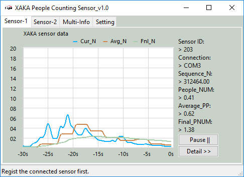

# Xandar_Sensor_App

**Program Design Purpose**: We want to create an application to visualize single/multiple Xandar Kardian people counting sensors detection result for a indoor area. 

[TOC]

### Introduction 

This project is aimed to develop an application to visualize single/multiple Xandar Kardian people counting sensors detection result for a indoor area. The application user interface contents chart pages to show the sensor detection history, a top-view of the monitoring area to show the people density and a config page for upload the data into the control center. 

Xandar Kardian people counting sensors : https://www.xkcorp.com/

##### Application UI View


`version: v_2.1`


------

### Program Design

The application contents three main pages: 

##### Data visualization dashboard

We will show the currently detection people count, average people count and finial normalized people count in a chart with different line color. We will also list sensor ID, connection interface, current data index in data queue (sequence number) and add a pause button to let the user can check the data. When the user press "Detail" button, a parameter display panel will show on the right to show the entire 36 parameters can read from the  Xandar Kardian sensor. 

The user can also switch among different sensors by click the tab, the data visualization dashboard is shown below: 



##### Top view monitoring are visualization dashboard 

We will show a top view map for the monitoring area and the connection information of different sensors as shown below: 


##### Control-Hub report config page

If we install several app in an indoor area we can config a hub and connect all the apps to report the data to the hub. The user can register the app to the hub with a unique signature. The detail is shown below:


------

### Program Setup

###### Development Environment : python 3.7.4

###### Additional Lib/Software Need

1. **wxPython** : https://docs.wxpython.org/index.html

   ```
   Install: pip install wxPython
   ```

2.  --

###### Hardware Needed: Xandar Kardian


###### Program Files List 

| Program File            | Execution Env | Description                           |
| ----------------------- | ------------- | ------------------------------------- |
| src/XAKAsensorRd.py     | python 3      | main UI frame                         |
| src/XAKAsensorPanel.py  | python 3      | UI function panels module.            |
| src/XAKAsensorComm.py   | python 3      | Sensor communication interface module |
| src/XAKAsensorGlobal.py | python 3      | Global parameters module              |
| src/img                 |               | image folder used by the program      |

version: V_2.1


------

### Program Usage/Execution

###### Program Execution

```
python XAKAsensorRd.py
```


------

### Problem and Solution

N.A

------

### Reference

Xandar Kardian people counting sensors : https://www.xkcorp.com/

------

> Last edit by LiuYuancheng(liu_yuan_cheng@hotmail.com) at 29/01/2022